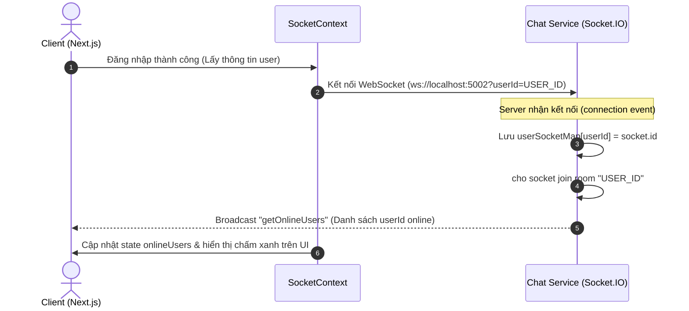
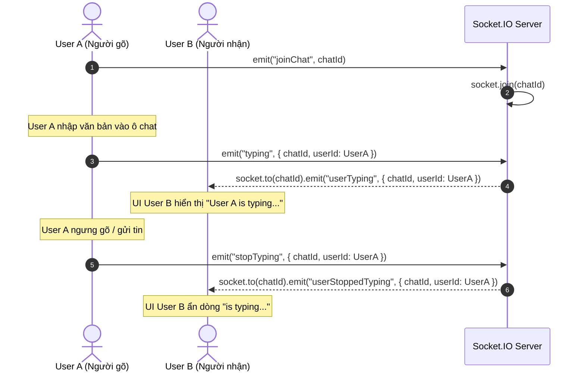
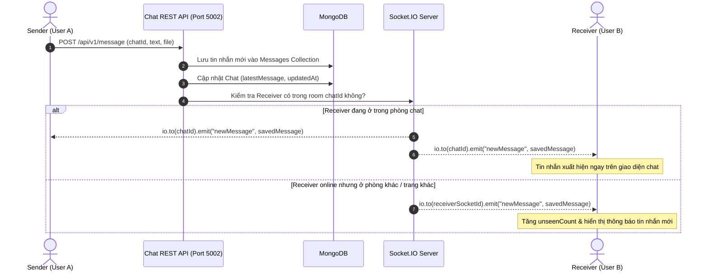
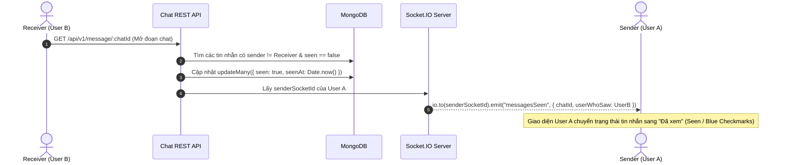

# 📚 SOCKET.IO & MICROSERVICE WORKFLOW DOCUMENTATION

Tài liệu chi tiết về Kiến trúc Microservice, các Cổng (Ports), Sự kiện Socket.IO (Events), và Luồng hoạt động (Workflows) trong dự án **Real-time Chat App**.

---

## 1. 🌐 Tổng quan các Cổng (Ports & Services Overview)

Hệ thống được thiết kế theo kiến trúc Microservices với các dịch vụ độc lập:

| Dịch vụ (Service) | Cổng (Port) | URL / Protocol | Chức năng chính |
| :--- | :--- | :--- | :--- |
| **Frontend** | `3000` | `http://localhost:3000` | Giao diện Next.js (Client UI, Pages, Components) |
| **User Service** | `5000` | `http://localhost:5000` | Quản lý người dùng, đăng ký, đăng nhập JWT, Profile |
| **Mail Service** | `5001` | `http://localhost:5001` | Gửi Email xác thực OTP qua RabbitMQ Consumer |
| **Chat Service & Socket.IO** | `5002` | `http://localhost:5002` `ws://localhost:5002` | Quản lý Tin nhắn, Phòng chat REST API & Server Realtime Socket.IO |
| **RabbitMQ** | `5672` / `15672` | `amqp://localhost` | Message Broker trao đổi thông tin bất đồng bộ (ví dụ: OTP Mail) |
| **MongoDB** | `27017` | `mongodb://localhost:27017` | Cơ sở dữ liệu NoSQL lưu trữ User, Chat, Message |

---

## 2. ⚡ Danh sách các Sự kiện Socket.IO (Socket.IO Events Reference)

### 📤 Server-side Emitted Events (Server gửi cho Client)

| Tên Event | Dữ liệu truyền (Payload) | Mô tả chi tiết |
| :--- | :--- | :--- |
| `getOnlineUsers` | `string[]` (Danh sách `userId`) | Gửi danh sách tất cả các ID người dùng đang online tới tất cả Client. |
| `newMessage` | `Message` object | Phát tin nhắn mới vừa được tạo tới phòng chat (`chatId`) hoặc phòng riêng của người nhận. |
| `userTyping` | `{ chatId: string, userId: string }` | Thông báo cho các user khác trong phòng chat rằng có người đang nhập tin nhắn. |
| `userStoppedTyping` | `{ chatId: string, userId: string }` | Thông báo dừng trạng thái đang gõ tin nhắn. |
| `messagesSeen` / `messageSeen` | `{ chatId: string, userWhoSaw: string }` | Gửi thông báo cho người gửi rằng tin nhắn của họ đã được người nhận mở xem. |

---

### 📥 Client-side Emitted Events (Client gửi lên Server)

| Tên Event | Dữ liệu gửi lên | Mục đích |
| :--- | :--- | :--- |
| *(Handshake Query)* | `{ query: { userId } }` | Gửi `userId` trong tham số URL kết nối ban đầu để Server map `userId` ↔ `socketId`. |
| `joinChat` | `chatId` (`string`) | Client gia nhập vào phòng Socket có tên là `chatId` để nhận tin nhắn thời gian thực của phòng đó. |
| `leaveChat` | `chatId` (`string`) | Client rời khỏi phòng Socket `chatId` khi chuyển sang phòng khác hoặc quay lại trang chính. |
| `typing` | `{ chatId, userId }` | Báo cho Server biết người dùng hiện tại đang gõ tin nhắn trong phòng `chatId`. |
| `stopTyping` | `{ chatId, userId }` | Báo cho Server biết người dùng đã ngừng gõ hoặc đã xóa ô input. |

---

## 3. 🔄 Các Luồng Hoạt Động Chi Tiết (Detailed Workflows)

### 🟢 Workflow 1: Kết nối & Đồng bộ Trạng thái Online (Connection & Online Status)

---

### 💬 Workflow 2: Tham gia Phòng Chat & Trạng thái Đang Gõ (Join Chat & Typing)

---

### 📩 Workflow 3: Gửi & Nhận Tin Nhắn Real-time (Send & Receive Message)

---

### 👁️ Workflow 4: Xác nhận "Đã Xem" Tin Nhắn (Read Receipts / Message Seen)

---

## 🛠️ 4. Tổng Kết Cấu Trúc Socket Room

1. **User Personal Room (`socket.join(userId)`)**: 
   - Mỗi kết nối socket tự động gia nhập vào 1 phòng riêng có tên chính là `userId`.
   - Mục đích: Dùng để gửi thông báo riêng tư, thông báo tin nhắn mới khi user đang ở ngoài phòng chat.
2. **Chat Group/Pair Room (`socket.join(chatId)`)**:
   - Gia nhập khi user bấm mở một cuộc trò chuyện cụ thể.
   - Mục đích: Nhận tin nhắn thời gian thực (`newMessage`), sự kiện đang gõ (`typing`/`stopTyping`) riêng cho cuộc trò chuyện đó.
